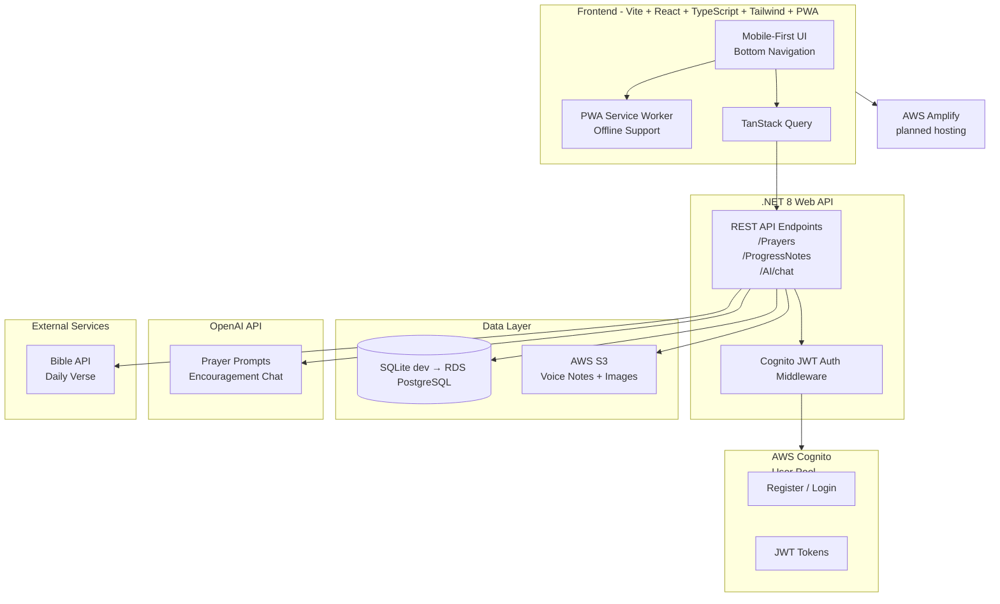

# FaithFlow Architecture

**Goal**: A clean, beautiful mobile-first PWA to help users build consistent prayer habits and grow in faith.

## High-Level Architecture

## AI integration (planned)

OpenAI is called **only from the .NET API** — the API key stays on the server. The React app sends user messages to `POST /api/ai/chat`; the backend applies a FaithFlow system prompt and forwards the request to OpenAI (`gpt-4o-mini` or similar).
